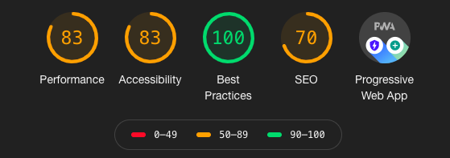

# book-my-place

The Book My Place app is a sample (AirBnB clone) Progressive Web Application which is developed using Ionic with Angular.

Hosting URL: [https://book-my-place-2c7d0.web.app](https://book-my-place-2c7d0.web.app)

### features:
* state Management (UI state, Local state, Persistent state)
* Auth forms (Login, Sign Up), Auth Guard, Auth Service
* Single Page Application (SPA) - Routing and Navigation
* Responsive design using SCSS style and themes
* slide to edit or delete list item
* PWA features - Location access, camera access
* PWA service worker

### Future Enhancement:
* PWA - Offline access, push notification
* Authentication token

### How to run locally:
* install node.js, Angular cli, ionic
* Run npm install in the extracted project
* Run ionic serve or ng serve to start the local dev server
